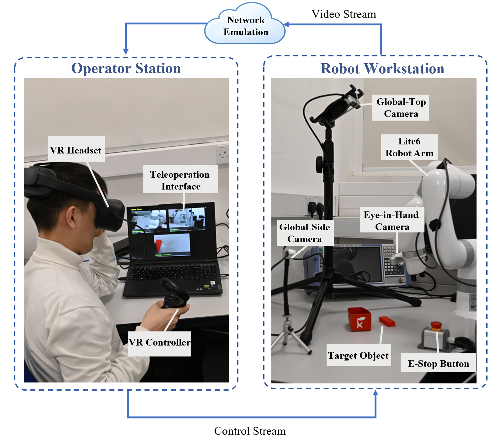

# TAMS: Task-Aware Multi-View Adaptive Streaming for Wireless Telerobotic Manipulation

**Zexin Deng, Zhenhui Yuan, Lu Tian, Subhash Lakshminarayana, and Longhao Zou**

Accepted as a **Full Paper** at the  
**23rd IEEE International Conference on Ubiquitous Intelligence and Computing (UIC 2026)**,  
part of the **IEEE Smart World Congress 2026 (SWC 2026)**.

Rende, Italy, September 7–11, 2026.

[IEEE UIC 2026](https://swc-ieee-2026.github.io/uic/)

<p align="center">
  
</p>

<p align="center">
  <em>
    TAMS experimental platform for wireless telerobotic manipulation.
    The operator station receives multi-view video feedback from the robot
    workstation over an emulated wireless network, while robot commands are
    transmitted through a separate control stream.
  </em>
</p>

## Overview

This repository provides a ROS 2 reference implementation of
**Task-Aware Multi-View Adaptive Streaming (TAMS)** for wireless
telerobotic manipulation.

TAMS dynamically allocates video bitrate according to the current
manipulation phase. It infers the task phase from lightweight
robot-side signals and prioritizes the camera view most relevant to
the operator while maintaining baseline visibility for secondary views.

The implementation follows the system design described in our paper.

## Repository Scope

This repository is intended as a reference implementation.
Hardware-specific drivers, private calibration parameters, and
experiment-specific scripts are not included.

## Nodes

- `phase_inference`: infers the current manipulation phase from
  end-effector velocity and gripper state.
- `bitrate_allocator`: maps the inferred phase and uplink budget to
  target bitrates for Eye-in-Hand (EIH), Global-Top (GT), and
  Global-Side (GS) streams.
- `stream_controller`: receives target bitrates and exposes the latest
  encoder targets for integration with a video pipeline.

## Build

```bash
colcon build --packages-select tams_ros2
source install/setup.bash
```

## Run

```bash
ros2 run tams_ros2 phase_inference
ros2 run tams_ros2 bitrate_allocator
ros2 run tams_ros2 stream_controller
```

## Interfaces

The reference implementation uses standard ROS 2 messages only.
Robot-specific adapters can publish compatible velocity, gripper,
and uplink budget topics.

## Citation

If you find TAMS useful in your research, please cite our paper.

The following BibTeX entry is provided for the accepted paper.
The DOI and page numbers will be added after the final IEEE Xplore
publication metadata becomes available.

```bibtex
@inproceedings{deng2026tams,
  author    = {Deng, Zexin and Yuan, Zhenhui and Tian, Lu and
               Lakshminarayana, Subhash and Zou, Longhao},
  title     = {{TAMS}: Task-Aware Multi-View Adaptive Streaming for
               Wireless Telerobotic Manipulation},
  booktitle = {2026 IEEE Smart World Congress (SWC)},
  year      = {2026}
}
```

## License

This project is released under the MIT License.
